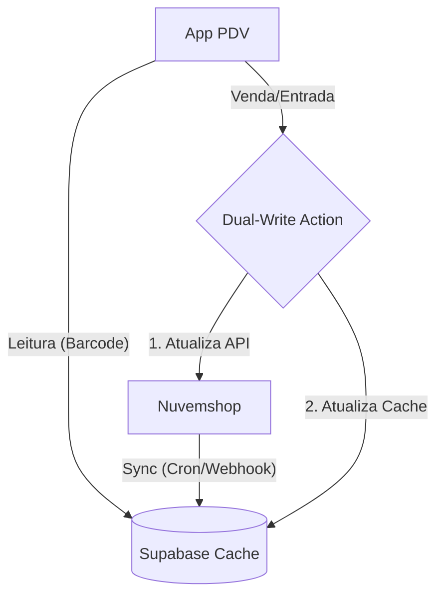

# Stock 720x - PDV Mobile & Controle de Estoque

> **Status:** 🟢 Fase 3 (Polimento & Core)
> **Stack:** Next.js 16 (React 19) + Supabase + Nuvemshop API

Sistema de Ponto de Venda (PDV) mobile-first desenvolvido para **sincronizar o estoque físico e online em tempo real**, eliminando furos de estoque e planilhas manuais.

---

## 🚀 Arquitetura de Dados (Dual-Write)

O sistema utiliza uma arquitetura híbrida de **Sync + Cache** para garantir performance instantânea no PDV sem depender da latência da API da Nuvemshop.



- **Fonte da Verdade:** Nuvemshop (Produtos, Preços, Estoque Master).
- **Cache de Alta Performance:** Supabase (Busca por barcode, logs de movimentação).
- **Operação no App:** Toda venda/entrada atualiza ambos os sistemas simultaneamente.
- **Offline-Ready:** O App funciona para consultas mesmo sem internet (se cacheado), mas requer conexão para transacionar.

---

## 🛠️ Stack Tecnológica

- **Frontend**: Next.js 16 (App Router) + React 19 RC
- **Estilo**: Tailwind CSS v4 (Pure)
- **Scanner**: `html5-qrcode` (Câmera do dispositivo)
- **PDF/QR**: `jspdf` + `qrcode`
- **Banco de Dados**: Supabase (PostgreSQL)

---

## ✨ Funcionalidades Atuais

| Módulo | Status | Descrição |
|--------|--------|-----------|
| 🛒 **PDV Mobile** | ✅ 100% | Venda rápida (Scan -> Carrinho -> Checkout) |
| 🔄 **Sincronização** | ✅ 100% | Dual-write e job de sync implementados |
| 📦 **Movimentação** | ✅ 100% | Entrada (Compra), Saída (Perda), Ajuste (Inventário) |
| 📊 **Relatórios** | 🔄 50% | Histórico de sessões de estoque disponível |
| 📱 **UX Mobile** | 🔄 80% | Design system pronto, faltando polimento visual |

---

## 📱 Fluxos de Movimentação

### 1. Venda (Saída)
```
Scan Barcode → Carrinho → Checkout → Baixa no Site + Supabase
```

### 2. Entrada de Estoque (Compra/Devolução)
```
Scan Produto → Qtd + Justificativa → Entrada no Site + Supabase
```

### 3. Inventário (Ajuste/Balanço)
```
Scan Prateleira → Compara Qtd Atual → Ajusta Divergência → Log de Perda/Sobra
```

---

## 📚 Documentação (Centralizada)

Toda a documentação técnica e de gestão está centralizada na pasta `docs/`.

👉 **Inicie aqui:** [`docs/00_PROJETO_MASTER.md`](docs/00_PROJETO_MASTER.md)

- **Planejamento:** [`docs/planejamento/`](docs/planejamento/) (Roadmap e Sprints)
- **Bugs:** [`docs/rastreamento/BUG_TRACKER.md`](docs/rastreamento/BUG_TRACKER.md)
- **Técnico:** [`docs/tecnico/`](docs/tecnico/) (Arquitetura e Manuais)

---

## 🛠️ Como Executar

### Pré-requisitos
- Node.js 20+ (Requerido pelo Next 16)
- Instância Supabase configurada
- App Nuvemshop (Client ID/Secret)

### Rodando Localmente

1. **Clone e Instale**
   ```bash
   git clone https://github.com/seu-usuario/stock-720x.git
   cd stock-720x/app  # IMPORTANTE: Projeto está na pasta app/
   npm install
   ```

2. **Configure Variáveis**
   Crie um `.env.local` na pasta `app/` com as chaves do Supabase e Nuvemshop (copie de `.env.example`).

3. **Inicie**
   ```bash
   npm run dev
   ```
   Acesse: `http://localhost:3000`

---

## 🤝 Workflow de Desenvolvimento (IA Team)

Este projeto utiliza um time de agentes de IA com funções definidas:
- **Arquiteto (Opus):** Planejamento e Análise de Bugs.
- **Dev Senior (Sonnet):** Implementação e Testes.
- **Dev Junior (Flash):** Rotinas simples.

Consulte `.agent/skills/ai_team_roles/SKILL.md` para detalhes.

---

**Desenvolvido para 720x** | 2026
