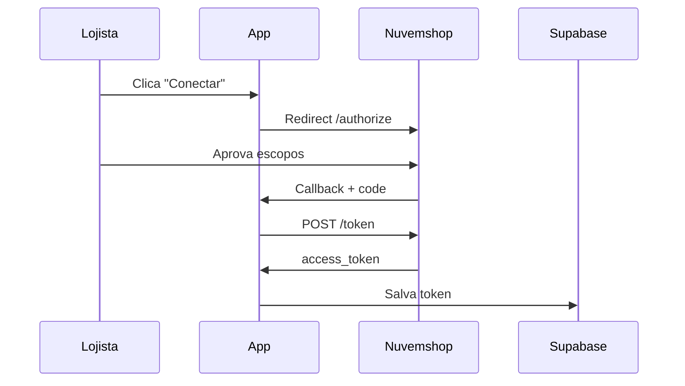
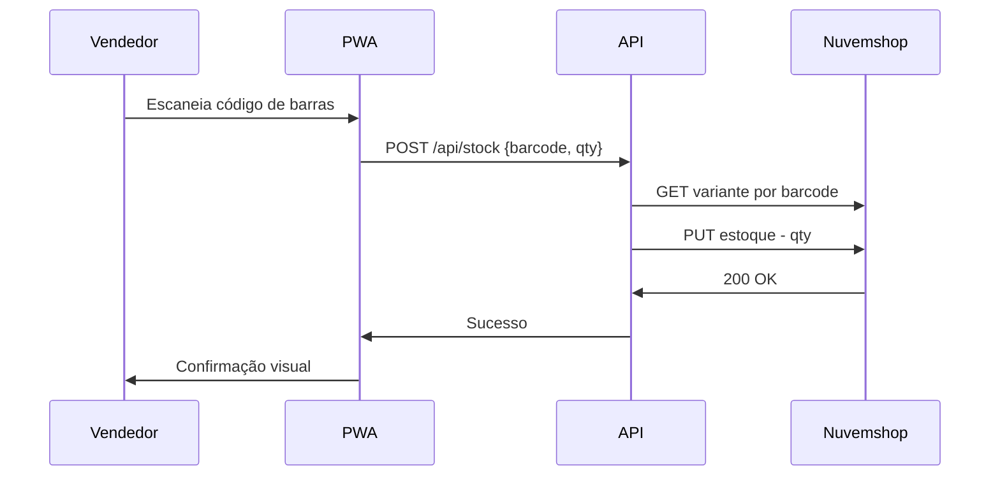

# Arquitetura Stock 720x

## Visão Geral

```
┌─────────────────────────────────────────────────────────────────┐
│                        STOCK 720x                               │
├─────────────────────────────────────────────────────────────────┤
│                                                                 │
│  ┌─────────────┐     ┌─────────────┐     ┌─────────────┐       │
│  │   PWA       │     │   Next.js   │     │  Nuvemshop  │       │
│  │   Mobile    │────▶│   API       │────▶│   API       │       │
│  │   (React)   │     │   Routes    │     │   REST      │       │
│  └─────────────┘     └──────┬──────┘     └─────────────┘       │
│                             │                                   │
│                      ┌──────▼──────┐                           │
│                      │   Supabase  │                           │
│                      │   (Postgres)│                           │
│                      └─────────────┘                           │
│                                                                 │
└─────────────────────────────────────────────────────────────────┘
```

## Stack Tecnológica

| Camada | Tecnologia | Justificativa |
|--------|------------|---------------|
| Frontend | React (PWA) | Mockup já existe, instalável no celular |
| Backend | Next.js 16 API Routes | Full-stack, deploy simples (Vercel) |
| Database | Supabase (PostgreSQL) | Auth pronto, realtime, RLS |
| Integração | API REST Nuvemshop | Aplicativo Externo ([ADR-001](./adr/001-tipo-app-nuvemshop.md)) |

## Estrutura do Projeto

```
Stock - 720x/
├── app/                    # Next.js 16 (Backend + API)
│   └── src/
│       ├── app/api/        # API Routes
│       └── lib/nuvemshop/  # Cliente Nuvemshop
├── mockup/                 # PWA React (Vite) - Protótipo
└── docs/                   # Esta documentação
```

## Fluxos Principais

### 1. Autenticação OAuth2



### 2. Venda no PDV (Baixa de Estoque)



## APIs Implementadas

| Endpoint | Método | Descrição |
|----------|--------|-----------|
| `/api/auth/login` | GET | Inicia fluxo OAuth2 |
| `/api/auth/callback` | GET | Recebe token |
| `/api/products` | GET | Lista produtos / busca barcode |
| `/api/stock` | POST | Baixa de estoque (venda) |
| `/api/stock` | PUT | Atualiza estoque direto |
